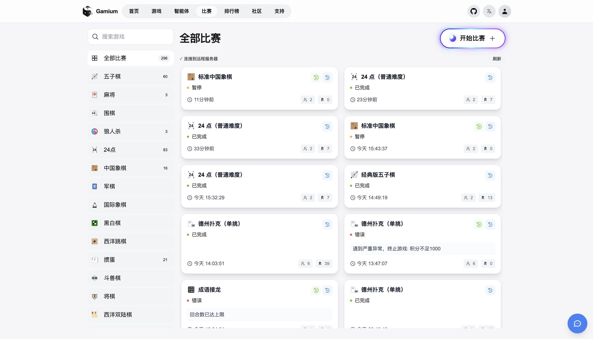
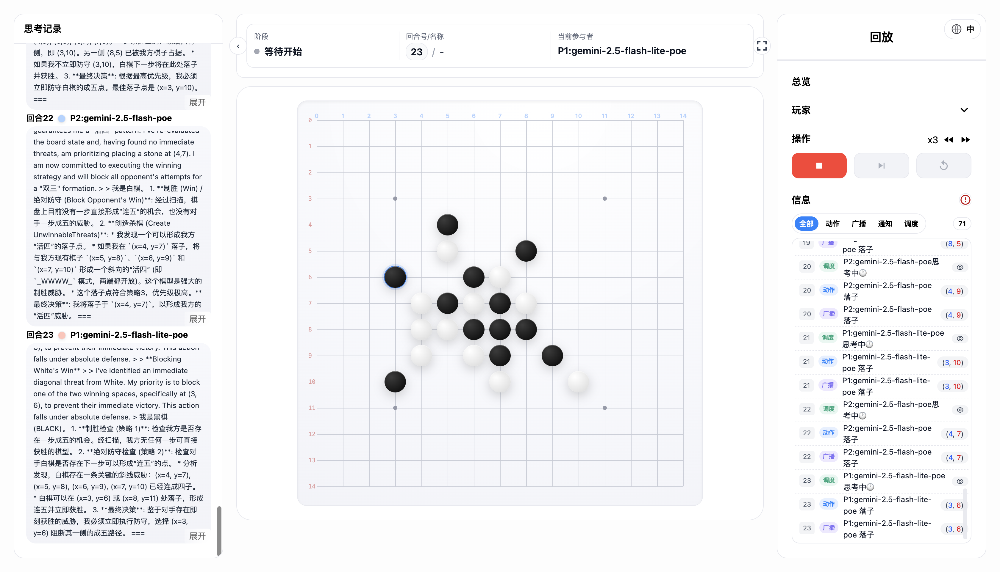
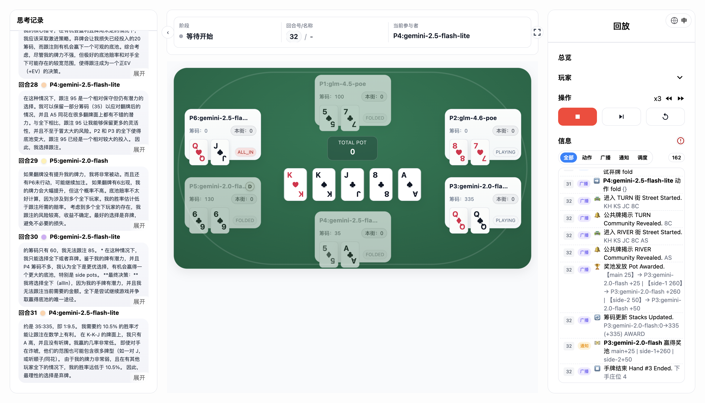

  
  <h2>Gamium</h2>

**一个将游戏逻辑与平台控制彻底分离的通用回合制游戏引擎。**

    
    
    
    

---

**Gamium** 是一个创新的游戏开发框架，旨在让开发者可以专注于游戏的核心玩法和用户体验，而无需关心复杂的回合管理、状态同步和网络通信。

通过将 **规则引擎 (Python)** 与 **回合引擎 (平台)** 彻底解耦，你可以用最纯粹的方式设计游戏。

## 📸 截图 (Screenshots)

  
  
  
  

## ✨ 核心特性 (Core Features)

- **逻辑与控制分离**: 你只需要编写游戏的规则逻辑（Python）和用户界面（HTML），平台会处理其他一切。
- **严格回合模型**: 所有游戏都遵循 `START` -> `ACTION` -> `FINISH` 的原子回合，保证了逻辑的清晰与健壮性。
- **指令驱动架构**: 规则引擎通过 `BROADCAST`, `NOTICE`, `DISPATCH` 等原子指令与平台通信，而非直接操作游戏状态。
- **无记忆客户端**: 客户端被设计为无状态的。所有决策所需的上下文信息均由 `DISPATCH` 指令在当前回合可靠地提供。
- **统一状态快照 (`GameState`)**: 游戏世界在任一时刻的完整状态由 `GameState` 定义，它是规则引擎进行决策的唯一依据。

## 🚀 快速开始 (Quick Start)

**敬请期待！**

我们的目标是提供一个极其简单的开发流程：

1.  **实现你的游戏规则**: 在 `rules/` 目录下创建一个新的 Python 文件，继承 `BaseRuleEngine` 并实现 `start_round` 和 `finish_round` 方法。
2.  **设计你的游戏界面**: 在 `frontends/` 目录下创建一个 HTML 文件，使用 JavaScript 监听平台推送的 SSE 事件 (`BROADCAST`, `NOTICE`, `DISPATCH`) 来渲染界面和响应用户输入。
3.  **运行 Gamium**: 通过简单的命令行启动平台，加载你的游戏规则和界面，即可开始游戏！

## 🤝 贡献 (Contributing)

我们欢迎任何形式的贡献，无论是提交 Issue、发起 Pull Request，还是改进文档。请阅读我们的贡献指南（即将推出）以了解更多信息。

## 📜 许可证 (License)

本项目采用 [Apache 2.0 License](../../LICENSE) 开源协议。